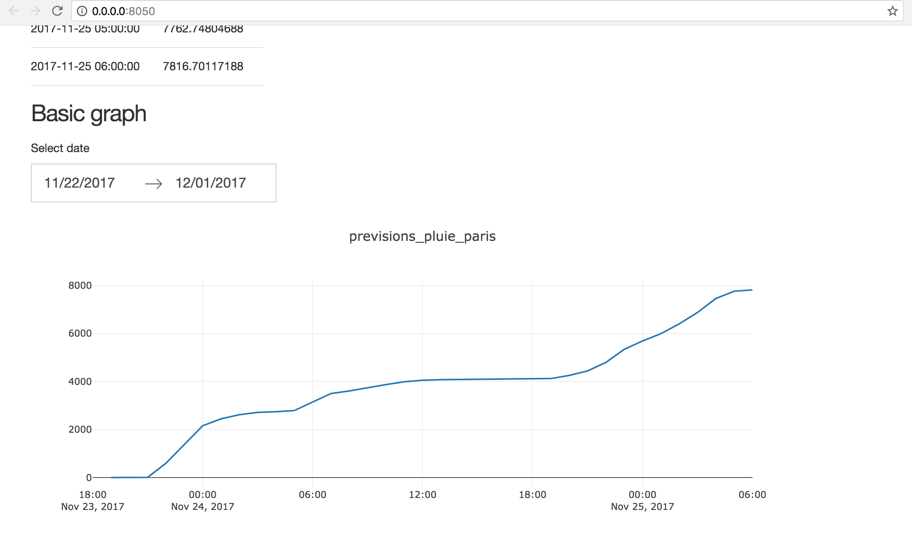

# Sample dsflow project

This is an example of a dsflow project, that generates a simple dashboard for weather forecast in Paris.

## Requirements

```

git clone https://github.com/dsflow-io/dsflow
git clone https://github.com/dsflow-io/dsflow-sample-project
cd dsflow-sample-project
source init.sh
```

`init.sh` sets two environment variables:
- `DSFLOW_ROOT` is the path of the dsflow CLI (`dsflow/dsflow/`)
- `DSFLOW_WORKSPACE` is the path of the dsflow project (`dsflow-sample-project`)

Edit `init.sh` if you organize your directories differently.

See detailed instructions about dsflow installation at https://github.com/dsflow-io/dsflow


## Contents of dsflow-sample-project

At first, the repository only contains the source code of the jobs:

```
jobs
├── create-table-meteo_agg
├── create-table-meteoparis
├── dashboard-previsions_pluie_paris
└── download-meteoparis
```

Run the jobs in order:

```
dsflow run download-meteoparis 2017-11-24
dsflow run create-table-meteoparis 2017-11-24
dsflow run create-table-meteo_agg 2017-11-24
dsflow run dashboard-previsions_pluie_paris

```

- The first job will download data and add it to `datastore/raw/`.
- The second and third jobs will create tables and add them to `datastore/tables/`.
- The fourth job will launch a simple dashboard, build with Plotly Dash.

After you run the first 3 jobs, you should have all resources in the `datastore/` directory. For instance:

```

datastore
├── managed-tables
├── raw
│   └── meteoparis
│       └── ds=2017-11-24
└── tables
    ├── meteo_agg
    │   └── ds=2017-11-24
    └── meteoparis
        └── ds=2017-11-24
```

The dashboard is accessible at http://0.0.0.0:8050/




## Customize and iterate on this project

Create new branch:

```
git checkout -b my_branch_name
```

Launch Jupyter to edit the jobs, running:

```
dsflow start-jupyter

```

Commit and push your changes.


## Finally

Quit dashboard:

```
CRL+C
```

Stop all dsflow containers

```
dsflow stop-all
```

## Go further with dsflow

The source code of dsflow (`$DSFLOW_ROOT`) is organized in a way that enables full customization: create new CLI commands, add more docker images, create additional job templates.

```
dsflow
├── dsflow-assistant.py                 # edit the CLI scripts, or create new commands
├── dsflow-build-images.py
├── dsflow-compose.py
├── ...
│
├── docker                              # edit or create new docker images
│   ├── adminer
│   │   └── docker-compose.yaml
│   ├── airflow
│   │   ├── Dockerfile
│   │   └── docker-compose.yaml
│   ├── assistant
│   │   ├── Dockerfile
│   │   └── docker-compose.yaml
│   └── ...
│
├── python_scripts                       # these scripts are meant to be used
│   ├── __init__.py                      # in the context of docker containers
│   ├── dsflow_core                      # (mounted as a volume to make dev. easier)
│   │   ├── cli_utils.py
│   │   ├── cli_utils.pyc
│   │   ├── helpers.py
│   │   └── utils.py
│   ├── dsflow-generate-job.py
│   ├── infer_schema.py
│   └── transform-ipynb-to-py.py
│
└── templates                            # edit or add new jobs templates
    ├── README.md
    └── jobs
        ├── create_table_from_json
        │   ├── README.md.j2
        │   ├── job_specs.yaml.j2
        │   ├── notebook.py.j2
        │   └── template_specs.yaml
        ├── create_table_from_sql
        │   ├── README.md.j2
        │   ├── job_specs.yaml.j2
        │   ├── notebook.py.j2
        │   └── template_specs.yaml
        ├── download_file
        │   ├── README.md.j2
        │   ├── job_specs.yaml.j2
        │   ├── script.sh.j2
        │   └── template_specs.yaml
        └── ...

```


Configuration of Jupyter and Spark is under `$DSFLOW_WORKSPACE/config`

```
├── config
│   ├── ipython-conf
│   │   └── profile_default
│   │       └── startup
│   │           ├── README
│   │           └── startup.py            # customize notebook startup code
│   ├── jupyter-conf
│   │   ├── jupyter_notebook_config.py    # customize Jupyter
│   └── spark-conf
│       └── spark-defaults.conf           # set Spark defaults

```


## Pipeline creation and scheduling with airflow

Add you airflow DAGs to `airflow/dags/`

You can run dsflow jobs using Airflow using a BashOperator. For instance:

```py

def dsflow_job_operator(job_name):
    return BashOperator(
        task_id=job_name,
        bash_command="python $DSFLOW_ROOT/dsflow-run.py {{ params.job_name }} {{ ds }}",
        params={'job_name': job_name},
        dag=dag)


t1 = dsflow_job_operator("download-meteoparis")
t2 = dsflow_job_operator("create-table-meteoparis")
t3 = dsflow_job_operator("create-table-meteo_agg")

t1 >> t2 >> t3
```

Open the Airflow web UI with `dsflow start-airflow`.
Airflow URL is http://localhost:8081

Use the toggle to activate your DAG. If its `start_date` is yesterday or sooner,
then Airflow will start running the job.


## Next dsflow release

We will add a `dsflow generate-dag` command to assist you
in the creation of new pipelines from existing jobs.
